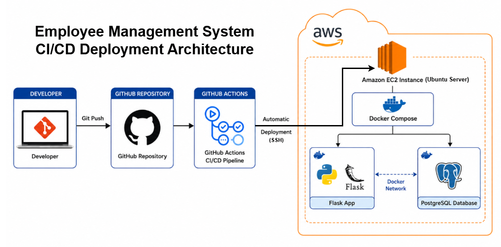

# Employee Management System

A full-stack Employee Management System built using Flask and PostgreSQL, containerized with Docker and deployed automatically to AWS using GitHub Actions CI/CD.

---

## Project Overview

This project demonstrates modern DevOps practices by combining application development, containerization, cloud deployment, and deployment automation.

The application allows users to manage employee records through a web interface while utilizing a PostgreSQL database for persistent storage.

---

## Features

- Add Employees
- View Employees
- Delete Employees
- PostgreSQL Database Integration
- Dockerized Application
- Multi-Container Architecture
- AWS Cloud Deployment
- Automated CI/CD Pipeline using GitHub Actions

---

## Architecture



Flow

```text
Developer
    ↓
Git Push
    ↓
GitHub Repository
    ↓
GitHub Actions
    ↓
AWS EC2
    ↓
Docker Compose
   /          \
Flask      PostgreSQL
```

---

## Technology Stack

### Backend

- Python
- Flask

### Database

- PostgreSQL

### Containerization

- Docker
- Docker Compose

### CI/CD

- GitHub Actions

### Cloud

- AWS EC2

### Version Control

- Git
- GitHub

---

## Screenshots

### Application

Screenshots/application-home.png

### Docker Containers

Screenshots/docker-containers.png

### GitHub Actions Pipeline

Screenshots/github-actions-deploy.png

### AWS Deployment

Screenshots/ec2-instance.png

---

## CI/CD Pipeline

```text
Code Change
      ↓
Git Commit
      ↓
Git Push
      ↓
GitHub Actions
      ↓
Deploy to AWS EC2
      ↓
Docker Compose Rebuild
      ↓
Application Updated
```

---

## Local Setup

### Clone Repository

```bash
git clone https://github.com/your-username/employee-management-system.git
cd employee-management-system
```

### Start Application

```bash
docker compose up -d --build
```

### Open Browser

```text
http://localhost:5000
```

---

## Project Structure

```text
employee-management-system
│
├── .github/
│   └── workflows/
│
├── Screenshots/
│
├── Documentation/
│   ├── Architecture.md
│   ├── CICD.md
│   ├── Troubleshooting.md
│   ├── Learning-Journey.md
│   └── Cost-Analysis.md
│
├── templates/
├── static/
├── Dockerfile
├── docker-compose.yml
├── app.py
├── db.py
├── requirements.txt
└── README.md
```

---

## Documentation

- Documentation/Architecture.md
- Documentation/CICD.md
- Documentation/Troubleshooting.md
- Documentation/Learning-Journey.md
- Documentation/Cost-Analysisysis.md

---

## Skills Demonstrated

- Flask Development
- PostgreSQL Database Management
- Docker & Docker Compose
- Git & GitHub
- GitHub Actions CI/CD
- AWS EC2 Deployment
- Linux Administration
- SSH-based Deployment
- Troubleshooting & Debugging

---

## Future Improvements

- Nginx Reverse Proxy
- HTTPS with Let's Encrypt
- Docker Hub Integration
- Amazon ECR
- Amazon ECS
- Terraform
- Kubernetes

---

## Author

**Raj S.N.**

DevOps & Cloud Engineering Enthusiast